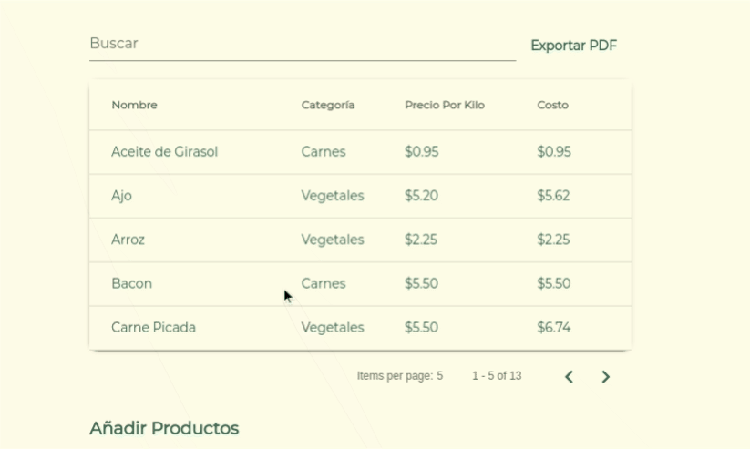
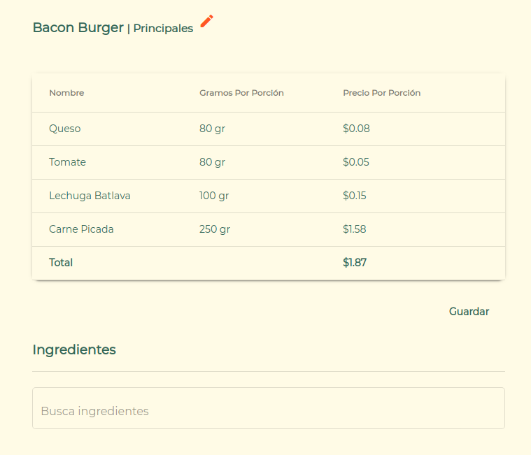
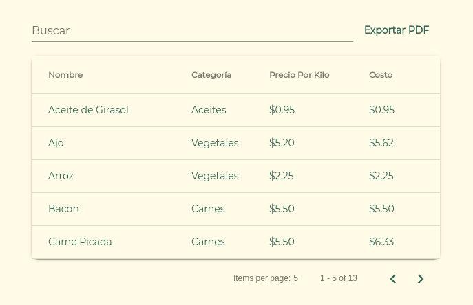
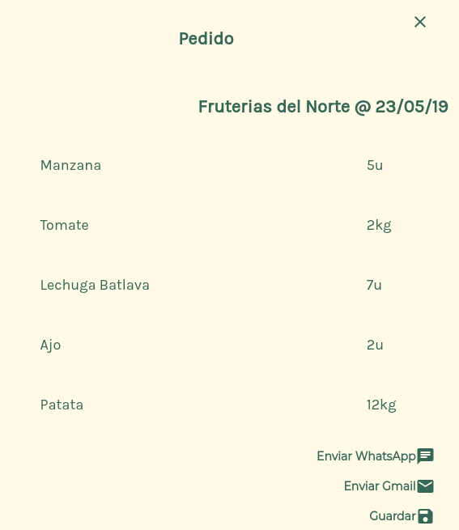

[Foodcep](https://www.foodcep.com "Foodcep") is an open source web app made to manage a restaurants' administrative labor more easily.

The goal of this app is to create an ideal enviroment for the management and administration of restaurants' kitchens, providing the user with essential planning and organization tools to keep track of the expenditures of any common restaurant kitchen.

Through a simple "roles" system, the user can invite their restaurant teammates in order to centralize product orders, cost evaluation, and writing & sharing recipes.

Every course of action inside a professional kitchen must be standarized for proper managing of the products. This standard will also lead to less wasted food and more money savings.

An intuitive user interface will help you organize and keep track of your ingredients, dishes, orers, and suppliers whenever you need it. 

This project uses Angular 7 on frontend, NodeJS on backend and the database is a MySQL Server.

You can find this project's code on the following repositories:

https://github.com/smaudd/foodcep-client

https://github.com/smaudd/foodcep-api

